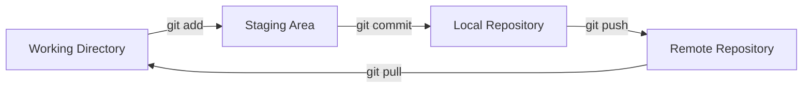
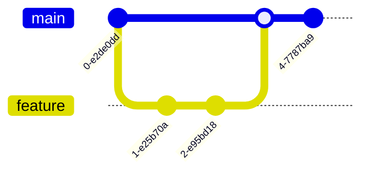
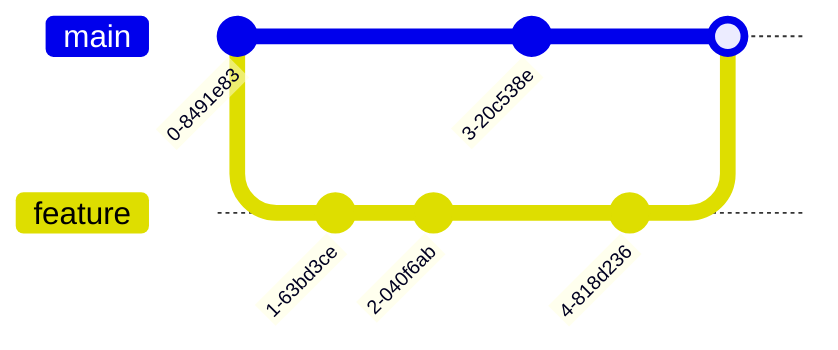

# Git and GitHub Cheatsheet

<div align="center">


**A Comprehensive Guide from Beginner to Advanced**

</div>

## Author

<div align="center">


**Md Shahed Fardous (Samy)**

[](https://github.com/shahedfardous/)
[](https://www.linkedin.com/in/shahedfardous/)
[](https://shahedfardous.com/)

</div>

---

This cheatsheet provides a comprehensive guide to Git and GitHub, ranging from beginner to advanced concepts. It includes practical examples and illustrations to help you understand and apply Git commands effectively.

## Table of Contents

1. [Beginner Level](#beginner-level)
   - [Setting up Git](#setting-up-git)
   - [Basic Commands](#basic-commands)
   - [Branch Operations](#branch-operations)
2. [Intermediate Level](#intermediate-level)
   - [Advanced Commit Operations](#advanced-commit-operations)
   - [Stashing](#stashing)
   - [Remote Operations](#remote-operations)
   - [Viewing History](#viewing-history)
3. [Advanced Level](#advanced-level)
   - [Rebasing](#rebasing)
   - [Submodules](#submodules)
   - [Hooks](#hooks)
   - [Advanced GitHub Features](#advanced-github-features)
   - [Git Internals](#git-internals)
4. [Git Workflow Illustrations](#git-workflow-illustrations)
5. [Practical Scenario: Contributing to an Open Source Project](#practical-scenario-contributing-to-an-open-source-project)

## Beginner Level

### Setting up Git

```bash
git config --global user.name "Your Name"
git config --global user.email "your.email@example.com"
```

### Basic Commands

- Initialize a new Git repository:
  ```bash
  mkdir my-project
  cd my-project
  git init
  ```

- Clone a repository from GitHub:
  ```bash
  git clone https://github.com/username/repo-name.git
  ```

- Stage changes for commit:
  ```bash
  git add file.txt
  git add .  # Stage all changes
  ```

- Commit staged changes:
  ```bash
  git commit -m "Add initial project files"
  ```

- Push commits to remote repository:
  ```bash
  git push origin main
  ```

- Fetch and merge changes from remote repository:
  ```bash
  git pull origin main
  ```

### Branch Operations

- List branches: `git branch`
- Create a new branch: `git branch <name>`
- Switch to a branch: `git checkout <branch>`
- Merge a branch into the current branch: `git merge <branch>`

Example workflow:
```bash
git branch feature-login
git checkout feature-login
# Make changes
git add .
git commit -m "Implement login functionality"
git checkout main
git merge feature-login
```

## Intermediate Level

### Advanced Commit Operations

- Modify the last commit:
  ```bash
  git commit --amend -m "Updated commit message"
  ```

- Create a new commit that undoes specified commit:
  ```bash
  git revert abc123  # Revert the commit with hash abc123
  ```

- Reset to a specific commit, discarding all changes:
  ```bash
  git reset --hard HEAD~1  # Reset to the commit before HEAD
  ```

### Stashing

- Temporarily store modified, tracked files: `git stash`
- Apply stored stash content and remove it: `git stash pop`
- List all stashed changesets: `git stash list`

Example workflow:
```bash
# You're working on a feature but need to switch branches
git stash
git checkout other-branch
# Do some work
git checkout original-branch
git stash pop  # Reapply your stashed changes
```

### Remote Operations

- Add a new remote repository:
  ```bash
  git remote add upstream https://github.com/original-owner/original-repository.git
  ```

- Download objects and refs from another repository:
  ```bash
  git fetch upstream
  ```

- Fetch and rebase instead of merging:
  ```bash
  git pull --rebase origin main
  ```

### Viewing History

- View commit history:
  ```bash
  git log --oneline --graph --decorate
  ```

- Show who last modified each line of a file:
  ```bash
  git blame README.md
  ```

## Advanced Level

### Rebasing

- Reapply commits on top of another base:
  ```bash
  git checkout feature-branch
  git rebase main
  ```

- Interactive rebase for editing commits:
  ```bash
  git rebase -i HEAD~3  # Interactively rebase the last 3 commits
  ```

### Submodules

- Add a new submodule:
  ```bash
  git submodule add https://github.com/username/library.git
  ```

- Initialize and update submodules:
  ```bash
  git clone https://github.com/username/project.git
  cd project
  git submodule update --init --recursive
  ```

### Hooks

Create scripts in `.git/hooks/` directory to automate Git actions
Example (pre-commit hook):
```bash
#!/bin/sh
# .git/hooks/pre-commit
npm run lint
```

### Advanced GitHub Features

- Pull Requests: Propose changes and collaborate
- GitHub Actions: Automate workflows
- GitHub Pages: Host websites directly from a GitHub repository

### Git Internals

- Objects: blobs, trees, commits, and tags
- Refs: pointers to commit objects

## Git Workflow Illustrations

### Basic Workflow



### Branching and Merging



### Rebasing



## Practical Scenario: Contributing to an Open Source Project

1. Fork the repository on GitHub
2. Clone your fork:
   ```bash
   git clone https://github.com/your-username/project.git
   ```
3. Set up upstream remote:
   ```bash
   git remote add upstream https://github.com/original-owner/project.git
   ```
4. Create a feature branch:
   ```bash
   git checkout -b feature-name
   ```
5. Make changes and commit:
   ```bash
   git add .
   git commit -m "Implement new feature"
   ```
6. Push to your fork:
   ```bash
   git push origin feature-name
   ```
7. Create a pull request on GitHub
8. Update your pull request (if requested):
   ```bash
   git add .
   git commit -m "Address review comments"
   git push origin feature-name
   ```
9. Sync your fork with upstream:
   ```bash
   git fetch upstream
   git checkout main
   git merge upstream/main
   git push origin main
   ```

This workflow demonstrates how to contribute to an open-source project using Git and GitHub, incorporating forking, branching, and pull requests.

---

<div align="center">

**© 2024 Md Shahed Fardous (Samy). All rights reserved.**

*Feel free to share this cheatsheet, but please provide attribution to the author.*

</div>
